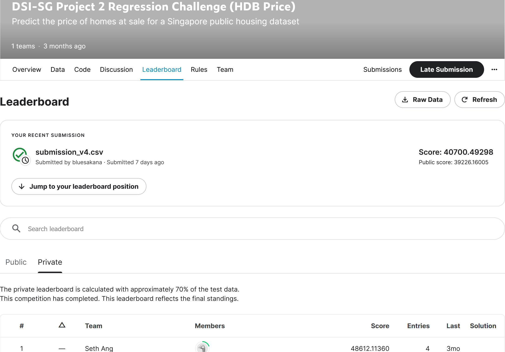

#  Project 2 - Singapore Housing Data and Kaggle Challenge

**Primary Learning Objectives:**
1. Creating and iteratively refining a regression model
2. Using [Kaggle](https://www.kaggle.com/) to practice the modeling process
3. Providing business insights through reporting and presentation.

----
## Problem Statement

We will create a regression model based on Singapore Housing Dataset to predict the price of a HDB at sale to help potential buyers estimate the amount they can expect to pay. The model will provide explanation as to which and how the features of the HDB flat affect the resale price to draw business insights for potential buyers. The predicted resale prices will also be submitted to a competition on [Kaggle](https://www.kaggle.com/competitions/dsi-sg-project-2-regression-challenge-hdb-price/overview) for the lowest Root-Mean-Squared-Error (RMSE).

The explanatory model will be different from the production model submitted to Kaggle, as the former is optimised for explainability or the latter is optimised for predictive power.

----
## Dataset

The HDB resale price dataset is an exceptionally detailed one with over 70 columns of different features relating to houses. The dataset and data dictionary reside [here](https://www.kaggle.com/competitions/dsi-sg-project-2-regression-challenge-hdb-price/data) and an offline version is available [here](./datasets/data_dictionary.md).

The full dataset is in the `datasets` folder:
- [`train.csv`](./datasets/train.csv): training dataset with all features and HDB resale prices
- [`test.csv`](./datasets/test.csv): test dataset with all features only, for submission to competition on Kaggle
- [`sample_sub_reg.csv`](./datasets/sample_sub_reg.csv): sample of the submission template

----
## Technical Report

The technical report is split into 5 parts in the `code` folder:
- [`01_Data_Cleaning.ipynb`](./code/01_Data_Cleaning.ipynb): A Jupyter notebook that cleans the dataset and exports the [`train_cleaned.csv`](./datasets/train_cleaned.csv) dataset into the `datasets` folder.
- [`02_Feature_Engineering.ipynb`](./code/02_Feature_Engineering.ipynb): A Jupyter notebook that focuses on Exploratory Data Analysis (EDA) and engineering of features needed for proposed predictive models which are exported to the `models` folder.
- [`03_Model_Tuning_Evaluation.ipynb`](./code/03_Model_Tuning_Evaluation.ipynb): A Jupyter notebook that focuses on fitting the proposed models and assessing the performance of each model using RMSE.
- [`04_Model_Production_Business_Insights.ipynb`](./code/04_Model_Production_Business_Insights.ipynb): A Jupyter notebook that takes the best model to fit on the full training dataset to obtain the production model, and uses the explanatory model to provide business insights.
- [`05_Kaggle_Submission.ipynb`](./code/05_Kaggle_Submission.ipynb): A Jupyter notebook that takes in the production model and predicts the HDB resale prices for the test dataset, and exports the predictions for submission to Kaggle.

In addition to the Jupyter notebooks, there are 3 python scripts that contain user-defined functions to aid in the data cleaning and analysis:
- [`data_cleaning.py`](./code/data_cleaning.ipynb): user-defined functions for data cleaning.
- [`model_metrics.py`](./code/model_metrics.ipynb): user-defined functions for measuring a number of different model performance metrics.
- [`subsegment_model.py`](./code/subsegment_model.ipynb): user-defined class with associated methods to run the sub-segment production model

----
## Performance of Model for Kaggle Submission

Based on the evaluation metric of root-mean-squared-error (RMSE), the production model performs well, with a public score of 39,226 and a private score of 40,700 (see appened screenshot).

----
## Conclusions and Recommendations

For a potential buyer looking for your HDB, location and flat type are the most influential factors that determine the resale price.

**Location**: A HDB in Marine Parade, Tanglin or Changi can expect to fetch a much higher resale price than other areas (more than \\$200k higher compared to Ang Mo Kio), while those in Woodlands and Sembawang are expected to see the lowest prices (more than \\$100k lower compared to Ang Mo Kio).

**Full Flat Type**: Unless the home owner is selling a Terrace, resale prices will largely follow the number of rooms, e.g., a 5-Room HDB is expected to fetch a higher resale price than a 4-Room HDB regardless of the layout.

**Flat Size**: The resale HDB will be $30k more expensive for every 100 sqft increase in size (i.e. every 100sqft increase in flat size is associated with \\$30k increase in resale price).

**Flat Storey**: A HDB on the 20th floor will be \\$42k more expensive that a similar HDB on the 10th floor (i.e. every 10 floor increase is associated with \\$42k increase in resale price).

**HDB Age**: A decrease in resale price of $46k is associated with every 10 years increase in HDB age.

The presence and distance to amenities such as malls and hawker centres have very little impact to resale prices overall.

### Future Work

This model is very specific to Singapore and may not generalise well to other cities. Nonetheless, to generalise to other cities, we can substitute `planning_area` with some form of measurement of distance to city centre, and simplify `full_flat_type` to just the number of rooms.

In addition, other features currently not in the dataset could be considered to provide a fuller picture of factors that may affect resale price. For instance, the distance to provision shops on top of malls; the distance to coffeeshops on top of hawker centres.